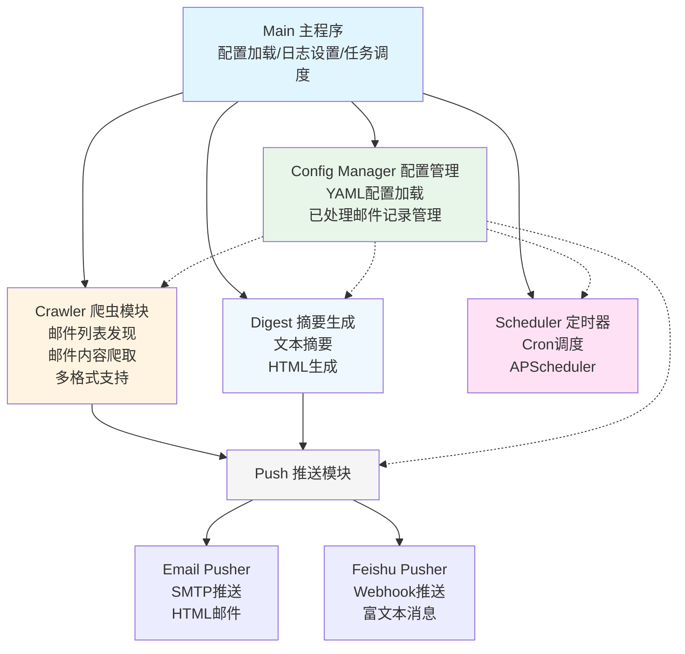
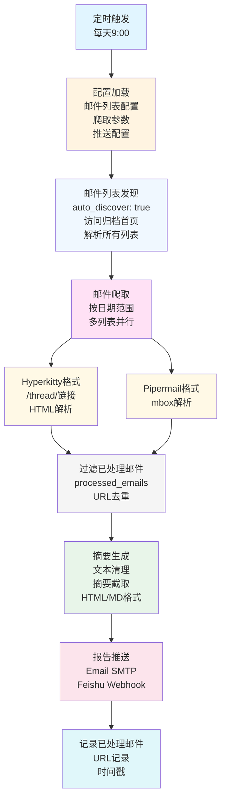

# Mailman邮件列表每日汇总工具 - 设计文档

## 1. 项目概述

### 1.1 背景

开源社区的邮件列表是重要的沟通渠道，每天都会产生大量邮件。为了方便社区成员快速了解邮件列表的最新动态，需要一个自动化工具能够：

- 定期从邮件列表归档页面爬取邮件
- 生成结构化的每日汇总报告
- 通过多种渠道推送报告

### 1.2 目标

- **自动化**：每日定时自动执行，无需人工干预
- **易配置**：通过配置文件灵活定制邮件列表和推送渠道
- **可扩展**：支持多种归档格式、多种推送方式
- **容器化**：支持 Docker 部署，易于运维

### 1.3 适用场景

- openEuler、openGauss 等开源社区的邮件列表监控
- 多个邮件列表的统一汇总
- 企业内部邮件列表的监控和通知

---

## 2. 系统架构

### 2.1 整体架构

采用**模块化设计**，分为以下核心模块：



### 2.2 数据流程



---

## 3. 模块设计

### 3.1 Crawler（邮件爬取模块）

**职责**：从邮件列表归档页面爬取邮件内容

**关键功能**：

1. **自动发现邮件列表** (`discover_lists`)
   - 访问归档首页（如 `https://mailweb.openeuler.org/archives/`）
   - 解析 HTML，提取所有邮件列表链接
   - 返回邮件列表名称列表（如 `dev@openeuler.org`）

2. **邮件内容爬取** (`get_emails_by_date_range`)
   - 支持日期范围参数（默认前一天）
   - 自动检测归档类型（Hyperkitty/Pipermail）
   - 每个邮件列表最多爬取 N 封邮件（可配置）

3. **多归档格式支持**

   **Hyperkitty 格式**（现代 Mailman）：
   - URL 格式：`/list/dev@openeuler.org/YYYY/MM/`
   - 邮件链接：`/thread/MESSAGE_ID/`
   - HTML 解析提取标题、作者、时间、正文

   **Pipermail 格式**（传统 mbox）：
   - URL 格式：`/pipermail/dev/YYYY-Month.txt`
   - mbox 格式解析
   - 提取邮件头和正文

**配置参数**：

```yaml
crawler:
  max_emails_per_list: 50  # 每个列表最大邮件数
  timeout: 30              # 请求超时（秒）
  delay: 1                 # 请求间隔（秒）
  use_proxy: false         # 是否使用代理
  proxy: ""                # 代理地址
```

**设计亮点**：

- **智能发现**：无需手动配置所有邮件列表
- **格式适配**：自动检测归档类型
- **优雅降级**：请求失败时记录错误，继续处理其他列表
- **防爬策略**：内置请求延迟，避免对服务器造成压力

---

### 3.2 Digest（摘要生成模块）

**职责**：将原始邮件内容转换为结构化摘要报告

**关键功能**：

1. **摘要生成** (`generate_summary`)
   - 清理邮件正文（移除 HTML 标签、多余空格）
   - 智能截取摘要（优先在句子结束处截断）
   - 支持多种截取长度（可配置）

2. **报告生成** (`format_report_html`, `format_report_text`, `format_report_markdown`)
   - 按社区和邮件列表分组
   - 生成多种格式报告（HTML、Markdown、纯文本）
   - 支持自定义模板

**输出格式示例**：

```markdown
# 每日邮件列表汇总 - 2026-05-08

## openEuler社区

### dev@openeuler.org

#### 1. Compiler SIG双周会议
- 作者：openEuler conference
- 时间：2026-05-07
- 摘要：邀请参加 Compiler SIG 双周会议，会议主题：...

#### 2. openEuler应用镜像2026年4月更新
- 作者：shuangsun
- 时间：2026-05-06
- 摘要：openEuler应用镜像2026年4月更新已完成...

---
**统计**：
- 总邮件数：10
- openEuler社区：7封
- openGauss社区：3封
```

**配置参数**：

```yaml
digest:
  summary_length: 200       # 摘要长度
  group_by_community: true  # 按社区分组
  group_by_date: true       # 按日期分组
  timezone: "Asia/Shanghai"
```

---

### 3.3 Push（推送模块）

#### 3.3.1 Email Pusher（邮件推送）

**职责**：通过 SMTP 发送 HTML 邮件

**关键功能**：

- 支持 SSL/TLS 加密连接
- 发送 HTML + 纯文本双格式邮件
- 自定义邮件主题模板
- 多接收者支持

**配置参数**：

```yaml
push:
  email:
    enabled: true
    smtp_server: "smtp.example.com"
    smtp_port: 465
    smtp_user: "your_email@example.com"
    smtp_password: "your_password"
    smtp_use_ssl: true
    from: "your_email@example.com"
    from_name: "邮件列表汇总机器人"
    recipients:
      - "recipient@example.com"
    subject_template: "【每日邮件列表汇总】{date}"
```

#### 3.3.2 Feishu Pusher（飞书推送）

**职责**：通过飞书机器人 Webhook 推送消息

**关键功能**：

- 发送富文本消息（卡片式）
- 支持消息标题和内容格式化
- 错误处理和日志记录

**配置参数**：

```yaml
push:
  feishu:
    enabled: true
    webhook_url: "https://open.feishu.cn/open-apis/bot/v2/hook/xxxxxxxx"
    use_rich_text: true
    title_template: "每日邮件列表汇总 ({date})"
```

**飞书消息格式**：

```json
{
  "msg_type": "interactive",
  "card": {
    "header": {
      "title": { "tag": "plain_text", "content": "每日邮件列表汇总" }
    },
    "elements": [
      {
        "tag": "div",
        "text": { "tag": "lark_md", "content": "**邮件总数**: 10封" }
      }
    ]
  }
}
```

---

### 3.4 Scheduler（定时调度模块）

**职责**：定时触发邮件汇总任务

**关键功能**：

- 基于 APScheduler 实现
- 支持 Cron 表达式配置
- 时区支持（Asia/Shanghai）
- 优雅停止（信号处理）

**配置参数**：

```yaml
schedule:
  cron: "0 9 * * *"       # 每天9:00执行
  timezone: "Asia/Shanghai"
  run_on_start: false      # 启动时是否立即执行
```

**Cron 格式**：

```
分钟 小时 日 月 星期
0    9    *  *  *     # 每天 9:00
30   8    *  *  1-5   # 工作日 8:30
0    18   *  *  Fri   # 每周五 18:00
```

**生命周期管理**：

- 启动时创建调度器
- 注册定时任务
- 监听 SIGINT/SIGTERM 信号
- 收到停止信号时优雅关闭

---

### 3.5 Config Manager（配置管理模块）

**职责**：加载和管理配置文件、记录已处理邮件

**关键功能**：

1. **配置文件加载**
   - YAML 格式配置文件
   - 配置验证和默认值填充
   - 错误处理和日志记录

2. **已处理邮件管理** (`ProcessedEmailsManager`)
   - 记录已推送邮件的 URL
   - 避免重复推送
   - 自动清理旧记录（30天）

**数据结构**：

```json
{
  "processed_emails": {
    "https://mailweb.openeuler.org/archives/list/dev@openeuler.org/thread/ABC123": {
      "processed_at": "2026-05-08 09:00:00",
      "subject": "Compiler SIG双周会议",
      "community": "openEuler社区",
      "list": "dev@openeuler.org"
    }
  }
}
```

---

## 4. 配置设计

### 4.1 配置文件结构

采用**分层配置**设计，支持灵活扩展：

```yaml
# 邮件列表配置
mailing_lists:
  - name: "社区名称"
    archive_url: "归档首页URL"
    auto_discover: true/false  # 自动发现或手动指定
    lists: []  # 手动指定时的邮件列表

# 爬取配置
crawler:
  max_emails_per_list: 50
  timeout: 30
  delay: 1

# 汇总配置
digest:
  summary_length: 200
  group_by_community: true

# 推送配置
push:
  email: {...}
  feishu: {...}

# 定时配置
schedule:
  cron: "0 9 * * *"
  timezone: "Asia/Shanghai"
```

### 4.2 配置优先级

```
命令行参数 > 环境变量 > 配置文件 > 默认值
```

**示例**：

```bash
# 命令行参数优先级最高
python main.py --days 15 --config /custom/config.yaml

# 环境变量覆盖配置文件
export SMTP_SERVER="smtp.custom.com"
```

---

## 5. 技术选型

### 5.1 核心技术栈

| 技术 | 用途 | 选择理由 |
|------|------|----------|
| **Python 3.11** | 主语言 | 生态丰富、易维护 |
| **requests** | HTTP请求 | 简单可靠、功能完善 |
| **BeautifulSoup4** | HTML解析 | 容易上手、性能好 |
| **APScheduler** | 定时任务 | 功能强大、支持Cron |
| **PyYAML** | 配置解析 | YAML格式友好 |
| **Docker** | 容器化 | 易部署、环境隔离 |

### 5.2 为什么选择这些技术？

**1. Python**
- 丰富的第三方库
- 强大的文本处理能力
- 社区活跃，易于找到解决方案

**2. APScheduler vs cron**
- APScheduler 更灵活（支持动态任务）
- 不依赖系统 cron
- 易于调试和监控

**3. Docker 部署**
- 环境一致性（避免依赖冲突）
- 易于迁移和扩展
- 支持资源限制

---

## 6. 部署方案

### 6.1 Docker 部署（推荐）

**优势**：
- 环境隔离
- 易于部署
- 支持自动重启

**部署步骤**：

```bash
# 1. 构建镜像
docker build -t mailman-digest:latest .

# 2. 启动容器
docker compose up -d

# 3. 查看状态
docker compose ps

# 4. 查看日志
docker compose logs -f mailman-digest
```

**Docker Compose 配置**：

```yaml
version: '3.3'

services:
  mailman-digest:
    build:
      context: .
      dockerfile: Dockerfile
    image: mailman-digest:latest
    container_name: mailman-digest
    restart: always  # 自动重启
    
    environment:
      - TZ=Asia/Shanghai
    
    volumes:
      - ./config:/app/config
      - ./data:/app/data
      - ./logs:/app/logs
      - ./output:/app/output
    
    deploy:
      resources:
        limits:
          cpus: '1'
          memory: 512M
```

### 6.2 资源规划

| 资源 | 推荐配置 | 说明 |
|------|----------|------|
| CPU | 1核 | 轻量级任务 |
| 内存 | 512MB | 处理邮件足够 |
| 存储 | 1GB | 日志和数据文件 |

### 6.3 高可用部署

**单机部署**（推荐）：
- 使用 Docker restart: always
- 定期备份 config/ 和 data/

**多实例部署**：
- 配置共享存储（如 NFS）
- 使用负载均衡分发推送任务

---

## 7. 扩展性设计

### 7.1 添加新的归档格式

**步骤**：

1. 在 `crawler.py` 添加新的格式检测方法
2. 实现爬取逻辑（如 `_crawl_new_format`）
3. 在 `_crawl_list_by_date_range` 中添加分支

**示例**：

```python
def _crawl_list_by_date_range(self, ...):
    if archive_type == 'hyperkitty':
        emails = self._crawl_hyperkitty(...)
    elif archive_type == 'pipermail':
        emails = self._crawl_pipermail(...)
    elif archive_type == 'new_format':  # 新格式
        emails = self._crawl_new_format(...)
```

### 7.2 添加新的推送渠道

**步骤**：

1. 创建新模块（如 `push_dingtalk.py`）
2. 实现推送类（继承或模仿现有 Pusher）
3. 在 `main.py` 中集成新推送渠道

**示例**：

```python
# push_dingtalk.py
class DingTalkPusher:
    def __init__(self, config):
        self.webhook_url = config.get('webhook_url')
    
    def send_message(self, content):
        # 实现钉钉推送逻辑
        pass

# main.py
from push_dingtalk import DingTalkPusher

dingtalk_config = push_config.get('dingtalk', {})
if dingtalk_config.get('enabled'):
    pusher = DingTalkPusher(dingtalk_config)
    pusher.send_message(report)
```

### 7.3 支持更多邮件字段

**当前支持**：
- 标题（subject）
- 作者（author）
- 时间（sent_time）
- 正文（body）

**扩展字段**：
- 附件信息
- 回复链（thread）
- 标签（tags）

---

## 8. 安全与性能

### 8.1 安全考虑

1. **敏感信息保护**
   - SMTP 密码不要暴露在日志中
   - 使用环境变量传递敏感配置
   - 配置文件添加到 `.gitignore`

2. **请求安全**
   - 使用 HTTPS
   - 设置合理的超时时间
   - 避免爬取压力（请求延迟）

3. **数据安全**
   - 定期备份已处理邮件记录
   - 日志文件权限控制

### 8.2 性能优化

1. **并发爬取**
   - 使用多线程/异步爬取多个邮件列表
   - 控制并发数避免服务器压力

2. **缓存机制**
   - 缓存邮件列表发现结果（减少重复请求）
   - 缓存 HTML 解析结果

3. **增量处理**
   - 只处理新邮件（基于 URL 去重）
   - 定期清理旧记录

---

## 9. 监控与运维

### 9.1 日志管理

**日志级别**：
- INFO：正常流程日志
- WARNING：配置错误、爬取失败
- ERROR：推送失败、严重错误

**日志文件**：
- `/app/logs/mailman-digest.log`
- Docker 日志（stdout）

**日志轮转**：
- Docker 配置 max-size: 10m
- 保留最近 3 个日志文件

### 9.2 健康检查

**Docker 健康检查**：

```dockerfile
HEALTHCHECK --interval=30s --timeout=10s \
  CMD python -c "import sys; sys.exit(0)"
```

**监控指标**：
- 容器运行状态
- 定时任务执行情况
- 件爬取成功率
- 推送成功率

### 9.3 故障排查

**常见问题**：

1. **爬取失败**
   - 检查网络连接
   - 检查归档 URL 是否正确
   - 查看错误日志

2. **推送失败**
   - 检查 SMTP 配置
   - 检查飞书 Webhook
   - 查看推送日志

3. **定时任务未执行**
   - 检查容器是否运行
   - 检查 cron 配置
   - 查看调度器日志

---

## 10. 未来规划

### 10.1 功能增强

- ✅ 支持更多归档格式（Mailman 3, MM3）
- ✅ 支持更多推送渠道（钉钉、Slack、微信）
- ✅ Web UI 界面（查看报告、配置管理）
- ✅ 邮件分析功能（热点话题、活跃用户）
- ✅ 历史数据查询（按日期、关键词）

### 10.2 性能优化

- ✅ 异步爬取（asyncio）
- ✅ 分布式爬取（多实例）
- ✅ 数据库存储（替代 JSON）

### 10.3 生态集成

- ✅ 与 CI/CD 集成（自动触发汇总）
- ✅ 与知识库集成（自动归档邮件）
- ✅ 与 IM 工具集成（实时推送）

---

## 11. 附录

### 11.1 代码结构

```
src/
├── __init__.py          # 包初始化
├── main.py              # 主程序入口
│   ├── setup_logging()  # 日志设置
│   ├── run_digest_task()# 汇总任务
│   └── main()           # 主函数
│
├── crawler.py           # 邮件爬取
│   ├── MailmanCrawler   # 爬虫类
│   ├── discover_lists() # 发现邮件列表
│   ├── get_emails_by_date_range() # 按日期爬取
│   └── crawl_all_lists()# 爬取所有列表
│
├── digest.py            # 摘要生成
│   ├── DigestGenerator  # 摘要生成器
│   ├── generate_summary()# 生成摘要
│   ├── format_report_*()# 格式化报告
│   └── generate_digest()# 生成完整报告
│
├── push_email.py        # 邮件推送
│   ├── EmailPusher      # 邮件推送器
│   └── send_email()     # 发送邮件
│
├── push_feishu.py       # 飞书推送
│   ├── FeishuPusher     # 飞书推送器
│   └── send_message()   # 发送消息
│
├── config_manager.py    # 配置管理
│   ├── ConfigManager    # 配置管理器
│   └ ProcessedEmailsManager # 已处理邮件管理
│   └── filter_new_emails() # 过滤新邮件
│
└── scheduler.py         # 定时调度
    ├── TaskScheduler    # 调度器类
    ├── add_daily_task() # 添加任务
    └── start_scheduler()# 启动调度器
```

### 11.2 配置示例

**完整配置文件**：

```yaml
# Mailman邮件列表每日汇总工具配置文件

mailing_lists:
  - name: "openEuler社区"
    archive_url: "https://mailweb.openeuler.org/archives/"
    auto_discover: true

crawler:
  max_emails_per_list: 50
  timeout: 30
  delay: 1
  use_proxy: false

digest:
  summary_length: 200
  group_by_community: true
  timezone: "Asia/Shanghai"

push:
  email:
    enabled: true
    smtp_server: "smtp.example.com"
    smtp_port: 465
    smtp_user: "user@example.com"
    smtp_password: "password"
    smtp_use_ssl: true
    from: "user@example.com"
    from_name: "邮件列表汇总机器人"
    recipients:
      - "recipient@example.com"
  
  feishu:
    enabled: true
    webhook_url: "https://open.feishu.cn/open-apis/bot/v2/hook/xxx"
    use_rich_text: true

schedule:
  cron: "0 9 * * *"
  timezone: "Asia/Shanghai"
  run_on_start: false

logging:
  level: "INFO"
  file: "/app/logs/mailman-digest.log"
  retention_days: 7

storage:
  processed_file: "/app/data/processed_emails.json"
  output_dir: "/app/output"
```

---

## 12. 总结

Mailman邮件列表每日汇总工具通过**模块化设计**、**配置化驱动**、**容器化部署**实现了自动化邮件监控和推送功能。核心设计特点：

- **自动化**：定时调度、自动发现、去重处理
- **可扩展**：支持多种归档格式、推送渠道
- **易运维**：Docker部署、日志完善、健康检查
- **高性能**：增量处理、智能摘要、资源限制

该工具已在 openEuler 社区验证，能够有效提升邮件列表监控效率，帮助社区成员快速获取最新动态。